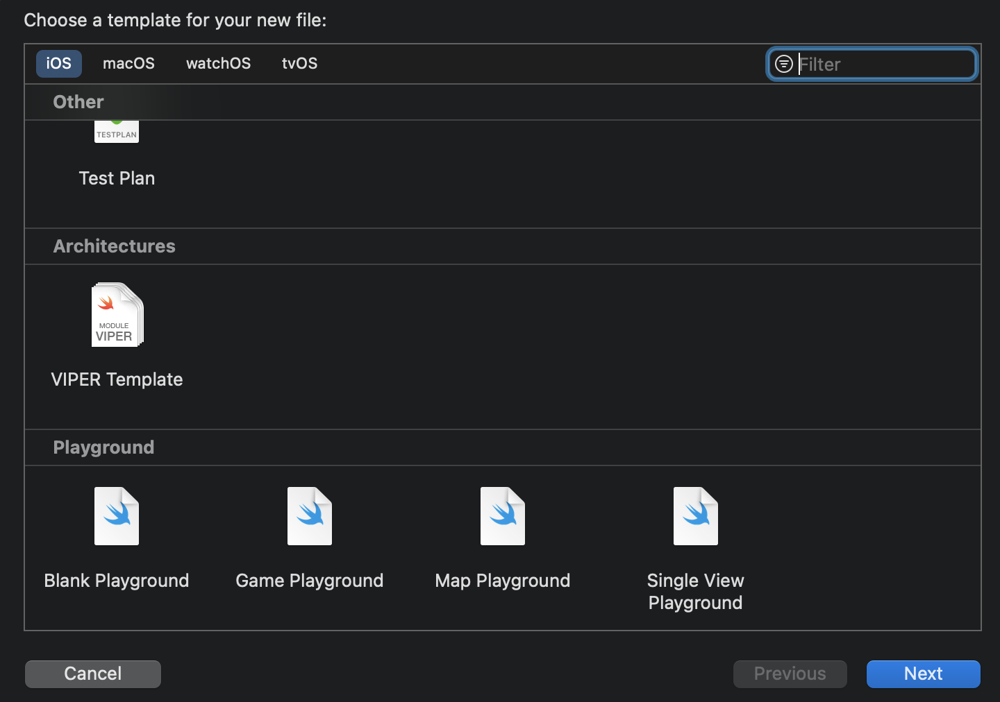

## Installation

1. Clone this repository 
2. Run these commands in terminal
```
chmod 755 ./viper_installer.sh
```
```
sudo ./viper_installer.sh
```


### 🎉 now you can see viper file templates when you want to make new file

 
